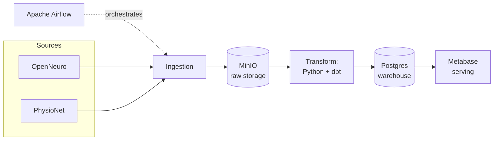

# EEG Research Data Platform

An end-to-end data engineering platform for public EEG (electroencephalography) research data. It ingests studies from public repositories (OpenNeuro, PhysioNet), lands raw files and metadata durably, standardizes heterogeneous per-study structures into a common data model, builds an analytical layer, and serves it for cross-study exploration.

This is a **data engineering** project — the focus is the pipeline (source → ingestion → storage → transformation → serving), not machine learning or clinical diagnosis. Full context, architecture reasoning, and phase-by-phase plan: **[docs/PROJECT_PLAN.md](docs/PROJECT_PLAN.md)**.

**Current status:** Phase 0 — infrastructure skeleton only. No ingestion/transformation/serving logic yet; see the roadmap in [docs/PROJECT_PLAN.md §8](docs/PROJECT_PLAN.md#8-phase-roadmap).

## Architecture



Full walkthrough of each component and why it exists: [docs/PROJECT_PLAN.md §3](docs/PROJECT_PLAN.md#3-target-architecture).

## Tech stack

Python 3.12 · Docker Compose · Apache Airflow (LocalExecutor) · MinIO · PostgreSQL 16 · dbt · Metabase (later phase) · pytest

Full chosen-vs-rejected reasoning per component: [docs/PROJECT_PLAN.md §4](docs/PROJECT_PLAN.md#4-tech-stack-table).

## Prerequisites

- Docker Desktop (or equivalent) with Docker Compose v2+
- Python 3.12
- git

## Setup

```bash
git clone https://github.com/leylaliyeva/eeg-data-platform.git
cd eeg-data-platform

cp .env.example .env
# Defaults work for local dev. Change credentials before running this
# anywhere other than your own machine.

python3 -m venv .venv
source .venv/bin/activate
pip install -r requirements.txt
```

A `Makefile` wraps the commands below — `make help` lists every target.

## Starting infrastructure

```bash
make up
# equivalent to: docker compose -f infra/docker-compose.yml --project-directory . up -d
```

| Service | URL | Login |
|---|---|---|
| Airflow UI | http://localhost:8080 | `AIRFLOW_ADMIN_USERNAME` / `AIRFLOW_ADMIN_PASSWORD` from `.env` |
| MinIO console | http://localhost:9001 | `MINIO_ROOT_USER` / `MINIO_ROOT_PASSWORD` from `.env` |
| Postgres warehouse | `localhost:5432` | `POSTGRES_WAREHOUSE_*` from `.env` |

Check every service reached a healthy state:

```bash
make ps
```

## Stopping infrastructure

```bash
make down     # stop, keep data
make destroy  # stop and wipe all data (fresh start)
```

## Running tests

```bash
make test
```

## Project structure

| Path | Purpose |
|---|---|
| `/ingestion` | Source-specific data-fetching jobs (OpenNeuro, PhysioNet). Currently placeholder clients — real logic lands once each source's access method is verified. |
| `/transformation` | Parses EEG files and standardizes per-study metadata into the common data model. Currently a placeholder — real logic lands once real dataset formats are inspected. |
| `/dbt` | dbt project modeling the analytical layer (staging → curated). Currently a valid, empty project skeleton. |
| `/orchestration` | Airflow DAGs (`orchestration/dags`), bind-mounted into the Airflow containers. Currently a single placeholder health-check DAG proving the wiring works. |
| `/config` | Central configuration loader — reads and validates required environment variables, used by every other package. |
| `/infra` | `docker-compose.yml` and any service init scripts. Defines every infrastructure service the platform depends on. |
| `/tests` | Automated tests (pytest), mirroring the structure above. |
| `/docs` | Documentation: [PROJECT_PLAN.md](docs/PROJECT_PLAN.md) (the detailed project plan) and [ETL_DESIGN.md](docs/ETL_DESIGN.md) (the thin-DAGs/fat-modules convention `/ingestion`, `/transformation`, and `/orchestration` follow). |

Each top-level directory currently contains real, importable placeholder modules (not empty `.gitkeep` files) where code will eventually live.

## Configuration

All configuration is centralized in environment variables, loaded via `config/settings.py`. `.env.example` documents every variable the platform needs; copy it to `.env` and adjust as needed. `.env` itself is git-ignored and must never be committed.
