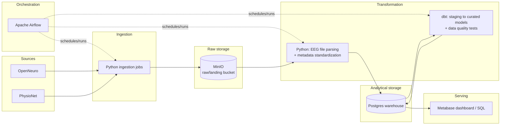

# Project Plan — EEG Research Data Platform

Status: Phase 0 (infrastructure skeleton). This document is written to be detailed enough that another engineer could implement the pipeline phases from it without further context.

---

## 1. Problem Statement

**Industry:** Neuroscience / biomedical research data engineering. This is explicitly a data platform project, not a clinical diagnosis or machine learning project — no models are trained and no diagnostic claims are made anywhere in this pipeline.

**The business question:** Public EEG research data is published across multiple independent repositories (OpenNeuro, PhysioNet), each with its own access method, file formats, and metadata conventions, and heterogeneity exists even *within* a single repository (studies vary in subject count, sessions, tasks, channel layouts, and sampling rates). A researcher who wants to work across several studies today has to manually download and inspect each one before knowing whether they're even comparable. The question this platform answers is: **given a research question, which publicly available EEG studies are relevant and comparable, without manually downloading and inspecting each one first?**

**Consumer of the output / decision supported:** EEG researchers and research data engineers deciding:
- Which studies are worth the bandwidth/storage cost of a full raw-data download
- Whether two or more studies can be pooled for cross-study analysis (e.g., do they share compatible sampling rates and channel layouts?)
- General dataset discovery and cataloging before committing to deeper analysis

---

## 2. Data Sources

| | OpenNeuro | PhysioNet |
|---|---|---|
| **Origin** | Open platform for sharing neuroimaging data (BIDS-formatted), including EEG studies from many independent research groups | Repository for physiological signal data, including EEG studies (resting-state, motor imagery, clinical recordings) |
| **Format** | BIDS-structured: raw EEG signal files (commonly EDF, BDF, BrainVision, or EEGLAB `.set`/`.fdt` depending on the study) plus TSV/JSON metadata (`participants.tsv`, `channels.tsv`, `events.tsv`, `dataset_description.json`) | Not uniformly BIDS-structured; formats and metadata layout vary more by study than on OpenNeuro |
| **Volume estimate** | Ranges roughly 1 MB–several GB per study platform-wide depending on channel count, duration, sampling rate, and subject count; the specific study selected for this project (`ds002778`) is a verified 0.53 GB — see below. | Same general order of magnitude platform-wide, and varies more by study than on OpenNeuro; the specific study selected (`eegmat`) is a verified 0.175 GB — see below. |
| **Update frequency** | Irregular — updated as researchers publish new studies, no fixed schedule | Same — irregular, publication-driven |
| **Sample record** | `participants.tsv` columns for `ds002778`, verified from the live file: `participant_id, age, gender, hand, MMSE, NAART, disease_duration, rl_deficits, notes` | Verified: `eegmat` groups 36 subjects into performance cohorts `G`/`B`, with a baseline and task EDF recording per subject |
| **Known quality issues** | Inconsistent completeness of optional metadata fields across studies; inconsistent channel-naming conventions across recording hardware/labs; occasional missing `events.tsv` | Same categories of issue, generally less standardized than OpenNeuro since BIDS compliance isn't a requirement |

Because this project treats ingestion as a **batch pull of a defined set of studies**, not a continuous sync, "update frequency" mainly matters for deciding when to re-run ingestion for a given study — not for pipeline scheduling (see §6).

**Datasets selected for this project:** `ds002778` (OpenNeuro) and `eegmat` (PhysioNet) — chosen after verifying file counts, sizes, and metadata directly against OpenNeuro's public S3 bucket and PhysioNet's dataset pages, not assumed from search results. Compared against 5 other real candidates in [DATASET_SELECTION.md](DATASET_SELECTION.md), which also has the full reasoning for this pairing.

| | `ds002778` (OpenNeuro) | `eegmat` (PhysioNet) |
|---|---|---|
| Subjects | 31 (16 healthy, 15 Parkinson's) | 36 (24/12 performance groups) |
| Format | BDF, 40 channels, 512 Hz | EDF, 23 channels, 500 Hz |
| Raw size | 0.53 GB | 0.175 GB |
| License | CC0 | ODC-BY 1.0 |
| Structure | BIDS; has `events.tsv`; some subjects have on/off-medication sessions | Not BIDS; 2 recordings/subject (baseline + task) |

Combined raw footprint: ≈720 MB. **Still open, first task of Phase 1:** the exact programmatic access method for each source, and formal confirmation that both datasets meet the de-identification/licensing bar beyond their published declarations.

---

## 3. Target Architecture



**Component walkthrough:**

- **OpenNeuro / PhysioNet (sources):** external systems this platform doesn't control. No uptime or schema guarantees, so ingestion is built to fail loudly and retry rather than assume availability.
- **Apache Airflow (orchestration):** schedules and runs ingestion and transformation jobs, tracks task state and retries, and gives observability into what ran, when, and whether it succeeded — the difference between "a pipeline" and "a folder of scripts someone runs by hand."
- **Ingestion jobs (Python):** pull raw files and metadata from a source and write them to MinIO with deterministic object keys (see §6 for idempotency).
- **MinIO (raw storage):** durable landing zone for raw files exactly as received. Kept separate from the warehouse so raw data can be reprocessed (e.g., after a bug fix in parsing logic) without re-downloading anything.
- **Transformation — Python (parsing):** reads raw EEG files out of MinIO, parses the binary signal format, and extracts structured metadata and derived signal statistics into Postgres staging tables.
- **Transformation — dbt (modeling):** turns staging tables into the curated, dimensional layer described in §5, with data quality tests (§7) enforced along the way.
- **Postgres warehouse (analytical storage):** holds both the staging and curated schemas.
- **Metabase (serving):** dashboards and ad hoc SQL over the curated layer, for the target users described in §1.

This is a **batch** architecture — EEG recordings are treated as static, already-published research files to pull on demand, not a live acquisition feed, so no streaming/message-queue component is included.

**Repository layout (maps 1:1 onto the components above):**

| Architecture component | Repository directory |
|---|---|
| Ingestion jobs | `/ingestion` |
| Transformation — parsing | `/transformation` |
| Transformation — modeling | `/dbt` |
| Orchestration (Airflow DAGs) | `/orchestration/dags` |
| Raw storage, warehouse, and every other infra service | `/infra` (`docker-compose.yml`) |
| Cross-cutting configuration | `/config` |
| Automated tests | `/tests` |
| Documentation | `/docs` |

Each directory is explained in more detail, with its current Phase 0 contents, in [README.md](../README.md#project-structure).

---

## 4. Tech Stack Table

| Component | Chosen technology | Reason | Rejected alternative |
|---|---|---|---|
| Language | Python 3.12 | Course-standard language; first-class libraries for HTTP, data handling, and (in a later phase) EEG file parsing | — (course-mandated) |
| Local runtime | Docker Compose | Reproducible, single-command local environment — required for "clone and run" | Manual/bare-metal setup — rejected: not reproducible across machines |
| Orchestration | Apache Airflow (LocalExecutor) | Course-taught orchestrator; gives retries, backfill, and run observability for a multi-source batch pipeline | Cron + plain scripts — rejected: no retries, no observability, no backfill; Prefect — rejected: not the tool this course covers |
| Raw/landing storage | MinIO (S3-compatible object storage) | Mirrors real-world object storage architecture; a MinIO bucket can be pointed at real AWS S3 later with no code change (same S3 API) | Plain local filesystem folder — rejected: doesn't demonstrate object-storage architecture and is harder to later swap for real S3 |
| Analytical warehouse | PostgreSQL 16 | Client-server relational database; strong JSON/array support for heterogeneous per-study metadata; what dbt targets in this stack | DuckDB/SQLite — rejected: embedded/single-process, doesn't demonstrate a real multi-service warehouse architecture; MySQL — rejected: weaker semi-structured data support |
| Transformation modeling | dbt (dbt-core + dbt-postgres) | SQL-based modeling with built-in testing, documentation, and lineage directly on top of Postgres | Hand-written SQL/Python-only transforms — rejected: no built-in testing/docs/lineage, harder to maintain as more studies are added |
| EEG file parsing *(the one additional tool — justification below)* | MNE-Python or pyedflib — final choice deferred to Phase 3 once real file formats are confirmed | No generic data-engineering tool reads EDF/BDF/BrainVision/EEGLAB binary formats; a domain-specific parser is required at the transformation boundary | Hand-written binary parsers — rejected: reinventing well-tested, error-prone format readers |
| Serving / BI | Metabase | Single-container deployment, simple to self-host at this scale, good for dashboards and ad hoc SQL | Apache Superset — rejected: heavier multi-service deployment (its own DB, Redis, workers) not justified at this project's scale |
| Testing | pytest (code) + dbt tests (data) | Course-standard Python testing tool; dbt's native data-quality testing integrates directly with the models it tests | Manual spot-checking — rejected: not automated or repeatable |
| CI | GitHub Actions | Free for public repos, integrates directly with the GitHub remote this project already uses | Other CI systems — rejected: unnecessary added infrastructure for a course project |

**Justification for the one new tool (EEG parsing library):** every other component above is a general-purpose data engineering tool covered by the course. EEG signal files, however, are stored in specialized binary formats that none of those tools can read. A narrow, well-tested parsing library is required purely as a utility inside the transformation step — it is not a platform the rest of the architecture depends on. The exact library (MNE-Python vs. the narrower pyedflib) is chosen once the real file format(s) of the selected datasets are confirmed in Phase 1/3, preferring the narrower dependency if it covers what's needed.

---

## 5. Data Model

**Source schema → raw/staging → curated**, following the general BIDS hierarchy (study → participant → session → task → recording → channel/event) that OpenNeuro requires and PhysioNet studies may or may not follow:

- **Source schema:** per-study files as published — `dataset_description.json`, `participants.tsv`, `sessions.tsv`, `channels.tsv`, `events.tsv`, and the raw signal files themselves.
- **Raw/staging layer:** MinIO holds files close to 1:1 with source layout; Postgres `staging` schema holds one ingestion-inventory table per source type, closely mirroring source fields, each row tagged with `_source`, `_ingested_at`.
- **Curated layer:** Postgres `curated` schema, a dimensional model:

| Table | Grain | Keys |
|---|---|---|
| `dim_study` | one row per (source, source_study_id) | Natural: (source, source_study_id). Surrogate: `study_key` |
| `dim_participant` | one row per (study_key, source_subject_id) | Natural: (study_key, source_subject_id). Surrogate: `participant_key` |
| `dim_session` | one row per (participant_key, source_session_id) | Natural: (participant_key, source_session_id). Surrogate: `session_key` |
| `dim_task` | one row per (study_key, task_name) | Natural: (study_key, task_name). Surrogate: `task_key` |
| `fact_recording` | one row per recording file | Surrogate: `recording_key`. FKs: study_key, participant_key, session_key, task_key |
| `dim_channel` / channel attributes | one row per (recording_key, channel_name) — modeled per-recording since channel layout can vary recording-to-recording even within a study | FK: recording_key |
| `fact_event` | one row per event/annotation instance within a recording | FK: recording_key |
| `fact_signal_statistic` | one row per (recording_key, channel_name) | FK: recording_key |

**SCD strategy:** dimensions use **SCD Type 1 (overwrite in place)**, not Type 2 (historized). These are published research artifacts that are rarely revised; when a correction does happen upstream (e.g., a fixed `participants.tsv`), downstream analysis should use the corrected version — there's no analytical need to preserve prior incorrect metadata. Each dimension carries an `updated_at` audit column so re-ingestion stays traceable without full history.

**Incremental strategy:** ingestion and transformation are idempotent and run **at study grain** — re-ingesting a study upserts its rows (keyed on natural keys) rather than appending duplicates. This is a full-refresh-per-study strategy rather than fine-grained row-level incremental loading, which fits the bounded, mostly-static nature of the source data without the added complexity of incremental merge logic that isn't justified at this scale.

---

## 6. Pipeline Design

- **Orchestration approach:** one Airflow DAG per source (`openneuro_ingest_dag`, `physionet_ingest_dag`), plus a downstream `transform_dag` that runs after ingestion DAGs complete.
- **Scheduling:** `schedule=None` (manually triggered). Source datasets are static published research artifacts, not continuously changing data — running on a fixed schedule would mostly re-process unchanged data. A human decides when to add or refresh a study.
- **Batch vs. streaming:** batch, deliberately — EEG recordings here are treated as static files to pull on demand, not a live acquisition stream (see §3).
- **Idempotency & re-run strategy:** MinIO objects are written with deterministic keys derived from `source/study_id/subject_id/session_id/filename`, so re-running ingestion overwrites the same object instead of duplicating it. Postgres writes use `INSERT ... ON CONFLICT (natural_key) DO UPDATE` upserts. Airflow tasks are safe to retry or re-run without side effects.
- **Failure handling:** per-task retries with backoff for transient network failures; a task that exhausts retries fails and blocks only its own downstream tasks — other studies/sources keep going. A **write-audit-publish** pattern is used for transformation: transformed data lands in a staging table first, data quality tests (§7) run against it, and only rows that pass are promoted to the curated tables the serving layer reads from — so a bad ingestion run never corrupts what's already being served.
- **Expected runtime:** not yet measurable. Given the bounded subset of studies planned for this course project (not full repository mirrors), a full pipeline run is expected to complete in minutes rather than hours; this will be measured and documented once the pipeline exists (Phase 1+).

Airflow is used strictly as an orchestrator here — DAGs schedule and sequence work but contain no extract/transform/load logic themselves. The code-level convention that keeps that true (where logic lives, what a DAG file is allowed to contain, how tasks pass data) is fixed in [ETL_DESIGN.md](ETL_DESIGN.md).

---

## 7. Data Quality Plan

**Checks enforced:**
- Schema/type validation on ingested metadata files (required columns present — e.g. `participants.tsv` must have `participant_id` — and correctly typed)
- Not-null checks on key fields (`sampling_rate`, `channel_count`, participant/study natural keys)
- Range checks (`sampling_rate > 0`, `duration > 0`, `channel_count > 0`)
- Referential integrity (every `fact_recording.study_key` exists in `dim_study`, every `fact_event.recording_key` exists in `fact_recording`, etc.)
- Uniqueness of natural keys within each dimension (no duplicate participant within a study, etc.)
- Row-count reconciliation between the raw layer and curated layer per study (no silent data loss)

**Enforcement mechanism:** dbt tests (`not_null`, `unique`, `relationships`, and range checks via a `dbt_utils`/custom generic test) run as a required step after each dbt run. The Airflow task that runs `dbt test` sits on the critical path of `transform_dag` — **if it fails, the promotion step doesn't run**, the DAG run is marked failed, and the failure is visible in the Airflow UI/logs. Combined with the write-audit-publish pattern in §6, a failed quality check means bad data stays in staging and never reaches what the serving layer reads from.

---

## 8. Phase Roadmap

| Phase | Scope | Definition of Done |
|---|---|---|
| **Phase 0** (current) | Repository, project structure, Docker Compose infrastructure (Postgres warehouse, Postgres Airflow metadata DB, Airflow, MinIO), central config, this plan document, README. No pipeline logic. | See the instructor-issued Phase 0 Definition of Done: remote repo pushed to `main`, `docs/PROJECT_PLAN.md` complete, README accurate and followed from scratch, structure matches the plan, fresh-clone `docker compose up` reaches healthy on every service, teardown/restart preserves state, `.env.example` complete with no real secrets committed, dependencies pinned, commit history incremental. |
| **Phase 1** *(proposed)* | Ingestion: implement `ds002778` (OpenNeuro) and/or `eegmat` (PhysioNet) ingestion as Airflow DAGs, pulling both datasets into MinIO, idempotently (see [DATASET_SELECTION.md](DATASET_SELECTION.md)). | Automated, idempotent ingestion of at least one source; ingestion inventory logged; unit tests with mocked HTTP responses; no manual download steps. |
| **Phase 2** *(proposed)* | Raw storage & cataloging: solidify raw-layer structure/lineage, add the second source, document bucket/object-key conventions. | Both sources ingested; lineage queryable; conventions documented. |
| **Phase 3** *(proposed)* | Transformation & standardization: parse EEG files (introducing the one new EEG-parsing library), map per-study metadata into the common data model, compute derived signal statistics into Postgres staging. | Transformation logic covered by unit tests; staging tables populated from real ingested data. |
| **Phase 4** *(proposed)* | Curated layer & orchestrated pipeline: dbt staging→curated models, data quality tests (§7) wired into `transform_dag`, full ingest→transform→test→publish chain runs end-to-end via Airflow. | dbt tests pass; curated tables populated; full pipeline runs via Airflow, not manual steps. |
| **Phase 5** *(proposed)* | Serving & final delivery: Metabase dashboards/saved queries over the curated layer answering the questions in §1; final documentation pass. | Working dashboard; complete docs (including a data dictionary); fresh clone runs end-to-end per README. |

Phases 1–5 are this student's proposed roadmap; per the assignment, the instructor publishes and finalizes the scope and Definition of Done for each phase only after the prior phase is accepted, so this roadmap is provisional beyond Phase 0.

---

## 9. Risks & Assumptions

| Risk / assumption | Mitigation |
|---|---|
| Local machine disk/compute limits vs. EEG file sizes | Bound ingestion to a small, explicitly chosen subset of studies/subjects (decided in Phase 1) — not full repository mirrors |
| Exact OpenNeuro/PhysioNet programmatic access methods not yet confirmed | Verify and document the access method as the first task of Phase 1, before writing ingestion code |
| Format/metadata heterogeneity across studies could break the common data model's assumptions | Data quality tests (§7) surface violations early; the data model may be revised in Phase 3 once real metadata is inspected |
| Dataset licensing/de-identification | Resolved for the two datasets selected — `ds002778` is CC0, `eegmat` is ODC-BY 1.0, both publicly de-identified per their publishers (see [DATASET_SELECTION.md](DATASET_SELECTION.md)); the same check applies to any dataset added later |
| Airflow's local resource footprint (webserver + scheduler + 2x Postgres + MinIO) is heavy for a laptop | LocalExecutor only (no Celery/Redis/worker); pinned lightweight images; documented `docker compose down -v` for full cleanup |
| *Assumption:* local Docker execution is the target environment (no cloud budget assumed) | Architecture (S3-compatible MinIO, standard Postgres, containerized Airflow) is portable to a cloud VM later without a redesign |
| *Assumption:* grading values a working, understandable, bounded-scope pipeline over raw data volume | Scope is deliberately kept small throughout |

---

## 10. How to Run

```bash
git clone https://github.com/leylaliyeva/eeg-data-platform.git
cd eeg-data-platform

cp .env.example .env
# Defaults in .env.example work for local dev; change credentials
# before running this anywhere other than your own machine.

python3 -m venv .venv
source .venv/bin/activate
pip install -r requirements.txt

docker compose -f infra/docker-compose.yml --project-directory . up -d

# Airflow UI:         http://localhost:8080  (login: AIRFLOW_ADMIN_USERNAME / AIRFLOW_ADMIN_PASSWORD from .env)
# MinIO console:       http://localhost:9001  (login: MINIO_ROOT_USER / MINIO_ROOT_PASSWORD from .env)
# Postgres warehouse:  localhost:5432         (credentials: POSTGRES_WAREHOUSE_* from .env)

pytest

# Stop, keep data:
docker compose -f infra/docker-compose.yml --project-directory . down
# Stop and wipe all data (fresh start):
docker compose -f infra/docker-compose.yml --project-directory . down -v
```

A `Makefile` wraps these (`make install`, `make up`, `make ps`, `make test`, `make down`, `make destroy`) — run `make help` for the full list.
